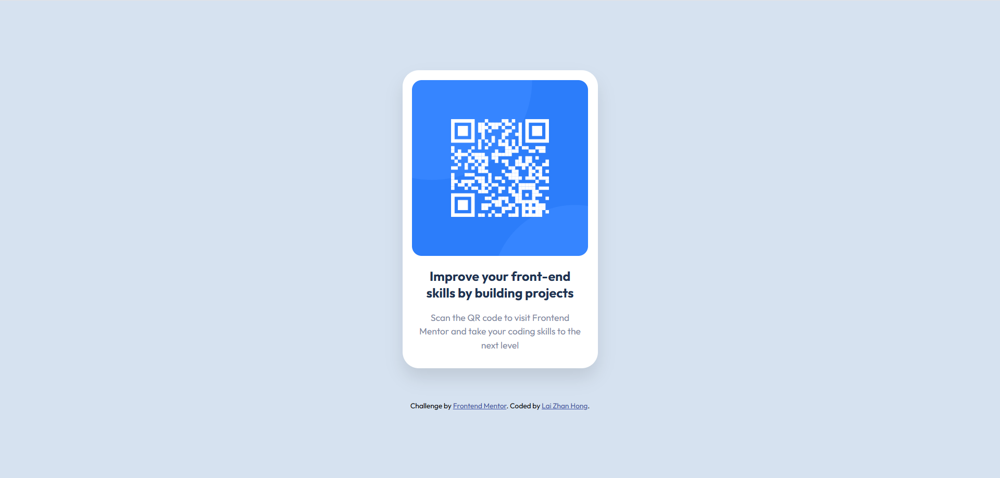

# Frontend Mentor - QR code component solution

This is a solution to the [QR code component challenge on Frontend Mentor](https://www.frontendmentor.io/challenges/qr-code-component-iux_sIO_H). Frontend Mentor challenges help you improve your coding skills by building realistic projects. 

## Overview

This challenge is to reproduce this UI 

### Screenshot
My version

### Links

- Solution URL: https://github.com/lzhong0119/Frontend-Mentor_Qr-code-challenge
- Live Site URL: https://lzhong0119.github.io/Frontend-Mentor_Qr-code-challenge/

### Built with

- Semantic HTML5 markup
- CSS custom properties
- Flexbox
- Mobile-first workflow
